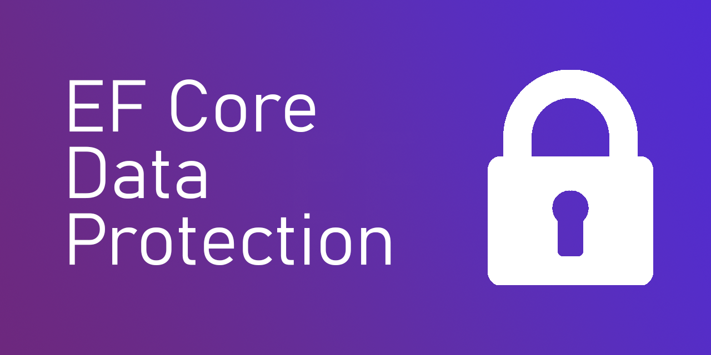

# Klean.EntityFrameworkCore.DataProtection

[](https://github.com/ddjerqq/Klean.EntityFrameworkCore.DataProtection/actions/workflows/test.yaml)
[](https://www.nuget.org/packages/Klean.EntityFrameworkCore.DataProtection)
[](https://www.nuget.org/packages/Klean.EntityFrameworkCore.DataProtection)



`Klean.EntityFrameworkCore.DataProtection` is a [Microsoft Entity Framework Core](https://github.com/aspnet/EntityFrameworkCore) extension which
adds support for data protection and querying for encrypted properties for your entities.

# What problem does this library solve?

When you need to store sensitive data in your database, you may want to encrypt it to protect it from unauthorized access, however, when you
encrypt data, it becomes impossible to query it by EF-core, which is not really convenient if you want to encrypt, for example, email addresses, or SSNs
AND then filter entities by them.

This library has support for hashing the salted sensitive data and storing their (Hmac Sha256) hashes in a shadow property alongside the encrypted data.
This allows you to query for the encrypted properties without decrypting them first. using `QueryableExt.WherePdEquals`

# Disclaimer

This project is maintained by [one (10x) developer](https://github.com/ddjerqq) and is not affiliated with Microsoft.

I made this library to solve my own problems with EFCore. I needed to store a bunch of protected personal data encrypted, among these properties were personal IDs, Emails, SocialSecurityNumbers and so on.
As you know, you cannot query encrypted data with EFCore, and I wanted a simple yet boilerplate-free solution. Thus, I made this library.

**What this library allows you to do, is to encrypt your properties and query them without decrypting them first. It does so by hashing the encrypted data and storing the hash in a shadow property alongside the encrypted data.**

I **do not** take responsibility for any damage done in production environments and lose of your encryption key or corruption of your data.

Keeping your encryption keys secure is your responsibility. If you lose your encryption key, **you will lose your data.**

## Currently supported property types

- string
- byte[]

# Getting started

### Installing the package

Install the package from [NuGet](https://www.nuget.org/) or from the `Package Manager Console` :

```powershell
PM> Install-Package Klean.EntityFrameworkCore.DataProtection
```

### Configuring Data Protection in your DbContext

`YourDbContext.cs`

```csharp
public class Your(DbContextOptions<Your> options, IDataProtectionProvider dataProtectionProvider) : DbContext(options)
{
    public DbSet<User> Users => Set<User>();

    protected override void OnModelCreating(ModelBuilder builder)
    {
        base.OnModelCreating(builder);
        builder.UseDataProtection(dataProtectionProvider);
    }
}
```

> [!WARNING]
> The call to `builder.UseDataProtection` **MUST** come after the call to `base.OnModelCreating` in your `DbContext` class
> and before any other configuration you might have.

### Registering the services

`Program.cs`

```csharp
builder.Services.AddDataProtectionServices();
```

To persist keys in file system use the following code:

```csharp
var keyDirectory = new DirectoryInfo("path/to/solution/.aspnet/dp/keys");
builder.Services.AddDataProtectionServices()
    .PersistKeysToFileSystem(keyDirectory);
```

> [!WARNING]
> If you want to query for encrypted properties, along with marking your properties as queryable, you **MUST** set 
> `EFCORE_DATA_PROTECTION__HASHING_SALT` in the environment. I could suggest you setting it to a random guid, or a very long string.
> This was implemented to prevent rainbow attacks on sensitive data.

> [!TIP]
> See the [Microsoft documentation](https://docs.microsoft.com/en-us/aspnet/core/security/data-protection/configuration/overview) for more
> information on **how to configure the data protection** services, and how to store your encryption keys securely.

### Configure the data protection options on your DbContext

`Program.cs`
```csharp
services.AddDbContext<YourDbContext>(opt => opt
    .AddDataProtectionInterceptors()
    /* ... */);
```

> [!WARNING]
> You **MUST** call `AddDataProtectionInterceptors` if you are using any encrypted properties that are queryable in your entities.
> If you are not using any queryable encrypted properties, you can skip this step.

## Usage:

### Marking your properties as encrypted

There are three ways you can mark your properties as encrypted:

Using the EncryptedAttribute:
```csharp
class User
{
  [Encrypt(isQueryable: true, isUnique: true)]
  public string SocialSecurityNumber { get; set; }

  [Encrypt(isQueryable: false, isUnique: false)]
  public byte[] IdPicture { get; set; }
}
```

> [!TIP]
> `isQueryable` marks a property as queryable (this will generate a shadow hash) <br/>
> `isUnique` marks a property as unique, and adds a unique index on the property. An index is added by default, even if the property is not marked as unique. However, that default index is not Unique. 

> [!WARNING]
> If you have a property that is marked as queryable, you **MUST** call `AddDataProtectionInterceptors` in your `DbContext` configuration.
> And you **MUST** set `EFCORE_DATA_PROTECTION__HASHING_SALT` in the environment. Otherwise, an exception will be thrown while trying to save the entity. 

Using the FluentApi (in your `DbContext.OnModelCreating` method):
```csharp
protected override void OnModelCreating(ModelBuilder builder)
{
  builder.Entity<User>(entity =>
  {
    //                                                                v defaults to true
    entity.Property(e => e.SocialSecurityNumber).IsEncryptedQueryable(isUnique: true);
    entity.Property(e => e.IdPicture).IsEncrypted();
  });
}
```

The above step also applies to custom `EntityTypeConfiguration`s

### Querying encrypted properties

You can query encrypted properties that are marked as Queryable using the `IQueryable<T>.WherePdEquals` extension method:

```csharp
var foo = await DbContext.Users
  .WherePdEquals(nameof(User.SocialSecurityNumber), "404-69-1337")
  .SingleOrDefaultAsync();
```

> [!WARNING]
> The `QueryableExt.WherePdEquals` method is only available for properties that are marked as Queryable using the `[Encrypt(isQueryable: true)]` attribute or the
> `IsEncryptedQueryable()` method.

> [!CAUTION]
> Before using `WherePdEquals` you **MUST** call `AddDataProtectionInterceptors` in your `DbContext` configuration.
> There will be no error if you forget to call `AddDataProtectionInterceptors`, but the query will not work as expected.

> [!NOTE]
> The `WherePdEquals` extension method generates an expression like this one under the hood:<br/>
> `Where(e => EF.Property<string>(e, $"{propertyName}ShadowHash") == value.HmacSha256Hash())`

### Profit!

---

## Esoteric usage:

> Q: How to use intermediary converters? <br/>
> A: If you have an entity that needs a custom converter, you are covered, all you have to do is specify that the property has a custom converter along with the `IsEncrypted` attribute.
```csharp
sealed record AddressData(string Country, string ZipCode)
{
    public static AddressData Parse(string str) => str.Split('-') switch
    {
        [var country, var zipCode] => new AddressData(country, zipCode),
        _ => throw new FormatException("Invalid format"),
    };

    public override string ToString() => $"{Country}-{ZipCode}";
}

// intermediary converter
class AddressToStringIntermediaryConverter() : ValueConverter<AddressData, string>(
        to => to.ToString(),
        from => AddressData.Parse(from));

// user configuration
class UserConfiguration : IEntityTypeConfiguration<User>
{
    public void Configure(EntityTypeBuilder<User> builder)
    {
        builder.Property(x => x.Address)
            // the order does not matter.
            .HasConversion<AddressToStringIntermediaryConverter>()
            .IsEncrypted();
    }
}
```

## Thank you for using this library!

ddjerqq <3